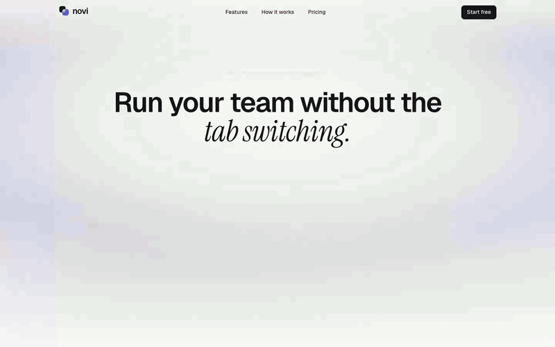
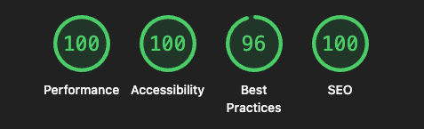

# Novi

A landing page for Novi, a project and task management tool for small, fast moving teams.



**Live preview:** _link coming soon (Vercel)_

## Run it

Requires Node 20.9+. pnpm is recommended (lockfile is `pnpm-lock.yaml`), npm works too.

With pnpm:

```bash
pnpm install
pnpm dev          # http://localhost:3000
```

With npm:

```bash
npm install
npm run dev       # http://localhost:3000
```

| pnpm                        | npm                           | What it does                                        |
| --------------------------- | ----------------------------- | --------------------------------------------------- |
| `pnpm build` / `pnpm start` | `npm run build` / `npm start` | Production build and server                         |
| `pnpm lint`                 | `npm run lint`                | ESLint (Next.js core web vitals + TypeScript rules) |
| `pnpm typecheck`            | `npm run typecheck`           | Generates Next route types, then `tsc --noEmit`     |
| `pnpm format`               | `npm run format`              | Prettier with Tailwind class sorting                |

## Stack

| Piece          | Choice                                                             |
| -------------- | ------------------------------------------------------------------ |
| Framework      | Next.js 16 (App Router, Turbopack), React 19, TypeScript strict    |
| Styling        | Tailwind CSS v4, tokens defined in `@theme`                        |
| Components     | Own design system, Radix primitives for dialog and sheet behaviour |
| Motion         | Motion (Framer Motion), plus CSS keyframes where JS isn't needed   |
| Drag and drop  | dnd-kit (pointer, touch and keyboard sensors)                      |
| Icons / toasts | lucide-react, sonner                                               |

No backend. All copy and fake data live in `src/content/content.ts`.

## What's on the page

1. **Hero.** Four messy app windows (chat, doc, spreadsheet, another board tool) jitter, then collapse into one Novi window. Inside is a real kanban board: drag cards between columns with mouse, touch or keyboard. Column counts update live and changes are announced to screen readers.
2. **Proof grid.** Bordered wordmark cells in place of a marquee (see decisions).
3. **Features bento.** Four cards, each with a working mini demo:
   - a board that shuffles itself and pauses on hover or when offscreen
   - a comment thread that types itself in, with typing dots and a reaction pop
   - a timeline with a draggable, keyboard-operable scrubber that lists what's in flight on that date
   - an import card that opens a modal: pick a source, watch the progress steps, get an animated checkmark
4. **How it works.** Three steps. On desktop the step list scrolls while the product canvas stays pinned and swaps visuals; a progress rail fills as you go.
5. **Pricing.** Monthly and yearly toggle with a sliding indicator and numbers that roll between prices.
6. **CTA band.** A tilted "This week" card whose last task checks itself off when it scrolls into view.
7. **Footer.** Email signup with idle, loading, success and error states plus toasts.

## Structure

```
src/
  app/            layout, page, globals.css (design tokens), icon, Open Graph image
  design-system/  Button, Heading/Em/Quiet/Text, Pill, Section/Container/Card, Avatar, Logo, Input
  components/
    ui/           Radix Dialog and Sheet wrappers, restyled with Novi tokens
    layout/       Navbar, MobileMenu, Footer, NewsletterForm
    sections/     Hero, ProofGrid, Features, HowItWorks, Pricing, CtaBand
    demos/        TabCollapse, KanbanBoard, ThreadDemo, TimelineDemo, ImportModal, ...
    motion/       Reveal helpers for scroll-triggered entrances
  content/        content.ts: every string and all fake data, typed
  hooks/          useScrolled, useActiveSection, useMagnetic, useSpotlight, useMediaQuery
  lib/            motion.ts (shared springs and variants), scroll.ts, utils.ts (cn)
```

Sections only compose design-system parts and never use raw Radix or shadcn markup. Tailwind's default colour palette is switched off (`--color-*: initial`), so only Novi tokens can be used.

## Design decisions

**Why the tab collapse.** The headline promises "without the tab switching", so the hero opens by showing the problem (four tools fighting for attention) and resolving it into one calm window. The rest of the page repeats the same idea: less noise, one place.

**Why live demos instead of screenshots.** The brief asks for animation and interactivity, and small teams judge a tool by how it feels. Every feature card is something you can use, not a picture of it.

**Why a calm palette.** Warm paper background, near-black ink, one muted indigo accent, and pastel status colours only inside product UI. Thin page rails and bordered cells (inspired by Attio) give a precise "tool" feel; serif italics on single words (inspired by editorial layouts) add warmth. Direction was chosen from generated comps before any code was written.

**Why a static proof grid instead of a marquee.** Scrolling logo tickers are hard to read and easy to ignore. A calm grid fits the brand promise better.

**Why own components on top of Radix.** Radix gives focus trapping, Escape handling and ARIA wiring for free. Visual styling stays in our own `cva` variants, so the page doesn't look like a default shadcn site.

**Added beyond the brief.** "How it works" and "Pricing" sections, so every nav link leads somewhere real.

## Accessibility and performance

- Semantic landmarks, skip link, visible focus rings, 44px minimum tap targets
- Keyboard support for the mobile menu (focus trap, Esc), kanban (space to pick up, arrows to move, Esc restores the board), timeline slider, import modal and pricing toggle
- Every animation respects `prefers-reduced-motion`: loops stop and demos render their final state
- All text meets WCAG AA contrast
- Hero headline animates with CSS only, so it paints before hydration

Lighthouse:


